# **Advanced Kustomize Features for Kubernetes Configuration Management**

## **Project Overview**

This project focuses on implementing advanced Kustomize capabilities to manage Kubernetes configurations across multiple environments such as development, staging, and production. By leveraging overlays, transformers, generators, ConfigMaps, and Secrets, we will create a flexible, reusable, and secure configuration structure that supports real-world deployment scenarios, particularly on Amazon EKS clusters.

## **Project Goals and Objectives**

**Goals:**

* To master advanced configuration management using Kustomize.
* To implement environment-specific Kubernetes deployments with overlays.
* To enhance configuration customization with transformers and generators.
* To securely handle sensitive data using ConfigMaps and Secrets.

**Objectives:**

1. Create a modular directory structure for Kustomize with base and overlay configurations.
2. Implement environment-specific overlays for dev, staging, and prod.
3. Apply transformers and generators to customize resource naming, labels, and annotations.
4. Generate ConfigMaps and Secrets to handle configuration data securely.
5. Deploy configurations to AWS EKS clusters using `kubectl` and `eksctl`.

## **Prerequisites**

1. **Kubernetes Basics** – Understanding of Kubernetes objects and concepts.
2. **Kustomize Installation** – Installed and configured for YAML customization.
3. **Docker Installation** – For container image management.
4. **kubectl Installation** – To interact with Kubernetes clusters.
5. **AWS CLI Installation** – For AWS service management.
6. **eksctl Installation** – For creating and managing EKS clusters.
7. **AWS Account with IAM Permissions** – For EKS cluster creation and resource management.
8. **Code Editor** – Recommended: Visual Studio Code with Kubernetes and YAML extensions.
9. **Internet Connection** – For tool downloads and AWS access.
10. **Computer with Adequate Resources** – To run the required tools smoothly.

## **Project Deliverables**

* A fully structured Kustomize project with base and overlay configurations.
* Environment-specific Kubernetes YAML configurations for dev, staging, and prod.
* ConfigMaps and Secrets securely integrated into the configurations.
* Applied transformations for resource customization.
* Deployment of the configurations to AWS EKS.
* Documentation for setup, usage, and deployment.

## **Tools & Technologies Used**

* **Kustomize** – For configuration customization.
* **Kubernetes** – Container orchestration platform.
* **kubectl** – Kubernetes command-line tool.
* **Docker** – Containerization platform.
* **AWS EKS** – Managed Kubernetes service.
* **AWS CLI** – AWS command-line interface.
* **eksctl** – CLI for EKS cluster management.
* **Visual Studio Code** – Code editing environment.
## **Project Components**

1. **Base Configuration** – Common Kubernetes manifests used across environments.
2. **Overlays** – Environment-specific modifications (dev, staging, prod).
3. **Transformers** – For customizing labels, annotations, and prefixes.
4. **Generators** – For ConfigMap and Secret creation.
5. **AWS EKS Deployment** – Cluster provisioning and deployment.


## **Task 1: Creation of Project Directory, Sub-directories, and Initial File Structure**

### Step 1 – Create and Navigate into the Main Project Directory

```bash
mkdir advanced-kustomize-features
cd advanced-kustomize-features
```

### Step 2 – Create Subdirectories

```bash
mkdir -p base
mkdir -p base/configs
mkdir -p overlays/dev
mkdir -p overlays/dev/configs
mkdir -p overlays/staging
mkdir -p overlays/staging/configs
mkdir -p overlays/prod
mkdir -p overlays/prod/configs
mkdir images
touch README.md
```

### Step 3 – Create Initial Files

```bash
# Base directory files
touch base/deployment.yaml
touch base/service.yaml
touch base/kustomization.yaml
touch base/configs/index.html

# Overlays: dev environment
touch overlays/dev/kustomization.yaml
touch overlays/dev/replica_count.yaml
touch overlays/dev/configs/index.html

# Overlays: staging environment
touch overlays/staging/kustomization.yaml
touch overlays/staging/replica_count.yaml
touch overlays/staging/service.yaml
touch overlays/staging/configs/index.html

# Overlays: prod environment
touch overlays/prod/kustomization.yaml
touch overlays/prod/replica_count.yaml
touch overlays/prod/service.yaml
touch overlays/prod/configs/index.html
```

### Step 4 – Final Project Structure Overview

```
advanced-kustomize-features/
├── base/
│   ├── configs/
│   │   └── index.html
│   ├── deployment.yaml
│   ├── service.yaml
│   └── kustomization.yaml
├── overlays/
│   ├── dev/
│   │   ├── configs/
│   │   │   └── index.html
│   │   ├── kustomization.yaml
│   │   └── replica_count.yaml
│   ├── staging/
│   │   ├── configs/
│   │   │   └── index.html
│   │   ├── kustomization.yaml
│   │   ├── replica_count.yaml
│   │   └── service.yaml
│   └── prod/
│       ├── configs/
│       │   └── index.html
│       ├── kustomization.yaml
│       ├── replica_count.yaml
│       └── service.yaml
├── images/
└── README.md
```

## **Task 2: Create Base Kubernetes Manifests and Base kustomization.yaml**

### Objective

Create the foundational Kubernetes manifests in the `base/` directory and configure the base `kustomization.yaml` to manage them.

### Step 1 – Create `deployment.yaml` in `base/`

This manifest defines a simple Kubernetes Deployment resource. For demonstration, it can be a generic app container like `nginx` or any placeholder image (you can replace the image later).

`base/deployment.yaml`:

```yaml
apiVersion: apps/v1
kind: Deployment
metadata:
  name: my-app
spec:
  replicas: 1
  selector:
    matchLabels:
      app: my-app
  template:
    metadata:
      labels:
        app: my-app
    spec:
      containers:
        - name: my-app-container
          image: nginx:stable
          ports:
            - containerPort: 80
```

### Step 2 – Create `service.yaml` in `base/`

This manifest exposes the Deployment as a Kubernetes Service.

`base/service.yaml`:

```yaml
apiVersion: v1
kind: Service
metadata:
  name: my-app-service
spec:
  selector:
    app: my-app
  ports:
    - protocol: TCP
      port: 80
      targetPort: 80
  type: ClusterIP
```

### Step 3 – Create `kustomization.yaml` in `base/`

This file defines the resources that Kustomize manages in the base.

`base/kustomization.yaml`:

```yaml
resources:
  - deployment.yaml
  - service.yaml
```

### Step 4 – Verify your base directory now looks like:

```
base/
├── deployment.yaml
├── service.yaml
└── kustomization.yaml
```

Once you create and save these files, you can test the base config with:

```bash
kubectl kustomize base/
```

This command will output the fully rendered Kubernetes manifests combining the base resources.

**Screenshot:** kubectl kustomize base
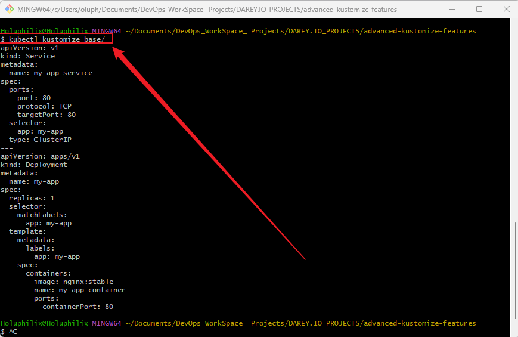

## **Task 3: Configure the Dev Overlay (Updated for New Kustomize Syntax)**

### Objective

Customize the base Kubernetes deployment for the development environment by patching the replica count using the current recommended Kustomize syntax.

### Step 1 – Create `replica_count.yaml` in `overlays/dev/`

This patch overrides the number of replicas to 2 for the dev environment:

```yaml
apiVersion: apps/v1
kind: Deployment
metadata:
  name: my-app
spec:
  replicas: 2
```

### Step 2 – Create or update `kustomization.yaml` in `overlays/dev/`

Use the modern syntax to reference the base resources and apply the patch explicitly:

```yaml
resources:
  - ../../base

patches:
  - path: replica_count.yaml
    target:
      kind: Deployment
      name: my-app
```

### Step 3 – Verify Directory Structure

```
overlays/
└── dev/
    ├── kustomization.yaml
    └── replica_count.yaml
```

### Step 4 – Test the Dev Overlay

Run:

```bash
kubectl kustomize overlays/dev/
```

You should see the Deployment manifest with `replicas: 2` correctly patched.

**Screenshot:** kubectl kustomize overlays/dev/
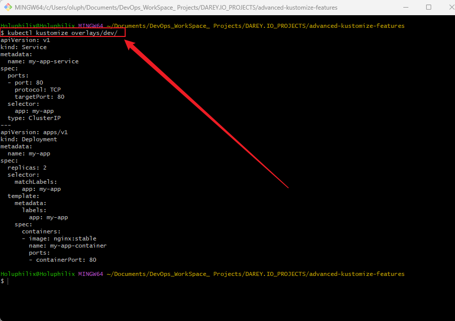

## **Task 4: Configure the Staging Overlay**

### Objective

Customize the base Kubernetes deployment for the staging environment by patching the replica count and adding environment-specific labels.

### Step 1 – Create `replica_count.yaml` in `overlays/staging/`

Set replicas to 3 for the staging environment:

```yaml
apiVersion: apps/v1
kind: Deployment
metadata:
  name: my-app
spec:
  replicas: 3
```

### Step 2 – Create or update `kustomization.yaml` in `overlays/staging/`

Use modern syntax to reference base resources, apply the patch, and add a common label:

```yaml
resources:
  - ../../base

patches:
  - path: replica_count.yaml
    target:
      kind: Deployment
      name: my-app

commonLabels:
  env: staging
```

### Step 3 – Verify Directory Structure

```
overlays/
└── staging/
    ├── kustomization.yaml
    └── replica_count.yaml
```

### Step 4 – Test the Staging Overlay

Run:

```bash
kubectl kustomize overlays/staging/
```

You should see the Deployment manifest with:

* `replicas: 3`
* The `env: staging` label added to all resources

**Screenshot:** kubectl kustomize overlays/staging/
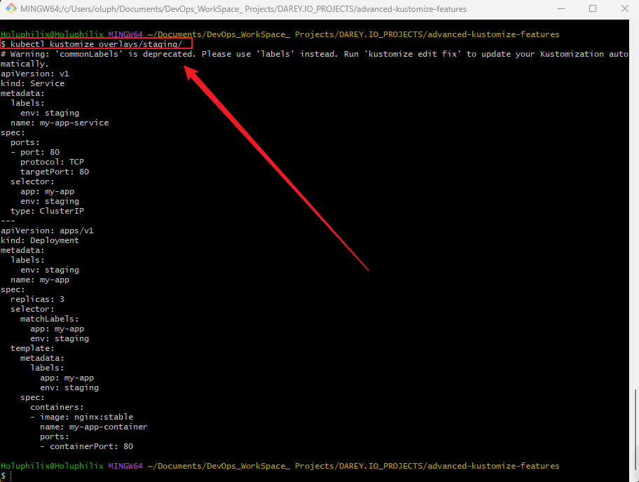


## **Task 5: Configure the Prod Overlay**

### Objective

Customize the base Kubernetes deployment for the production environment by patching the replica count and adding production-specific labels and name prefixes.

### Step 1 – Create `replica_count.yaml` in `overlays/prod/`

Set replicas to 5 for production:

```yaml
apiVersion: apps/v1
kind: Deployment
metadata:
  name: my-app
spec:
  replicas: 5
```

### Step 2 – Create or update `kustomization.yaml` in `overlays/prod/`

Use modern syntax to reference base resources, apply the patch, add a common label, and add a name prefix:

```yaml
resources:
  - ../../base

patches:
  - path: replica_count.yaml
    target:
      kind: Deployment
      name: my-app

commonLabels:
  env: production

namePrefix: prod-
```

### Step 3 – Verify Directory Structure

```
overlays/
└── prod/
    ├── kustomization.yaml
    └── replica_count.yaml
```

### Step 4 – Test the Prod Overlay

Run:

```bash
kubectl kustomize overlays/prod/
```

You should see the Deployment manifest with:

* `replicas: 5`
* The label `env: production` on all resources
* All resource names prefixed with `prod-` (e.g., `prod-my-app`)

**Screenshot:** kubectl kustomize overlays/prod/
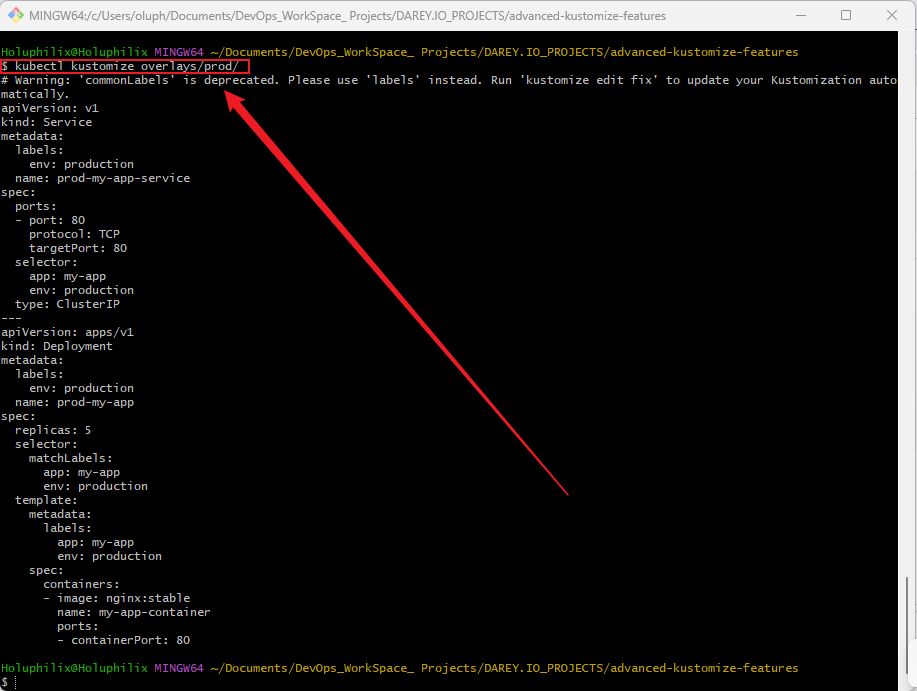

## **Task 6: Add ConfigMap and Volume Mount for Custom NGINX Content**

### Objective

Create a ConfigMap from an `index.html` file and mount it inside the NGINX container to serve custom content.

### Step 1 – Create `configs/index.html` in `base/`

Create a directory named `configs` inside `base/` and add a simple HTML file:

```html
<!-- base/configs/index.html -->
<!DOCTYPE html>
<html>
<head>
    <title>Welcome to Advanced Kustomize Features</title>
</head>
<body>
    <h1>Hello from the Custom NGINX Page!</h1>
    <p>This page is served from a ConfigMap volume.</p>
</body>
</html>
```

### Step 2 – Update `base/kustomization.yaml` to generate ConfigMap from the file

Add the following to your existing `base/kustomization.yaml`:

```yaml
configMapGenerator:
  - name: nginx-config
    files:
      - configs/index.html
```

### Step 3 – Update `base/deployment.yaml` to mount ConfigMap as a volume

Modify your Deployment to mount the ConfigMap at `/usr/share/nginx/html` inside the container:

```yaml
apiVersion: apps/v1
kind: Deployment
metadata:
  name: my-app
spec:
  replicas: 1
  selector:
    matchLabels:
      app: my-app
  template:
    metadata:
      labels:
        app: my-app
    spec:
      containers:
        - name: my-app-container
          image: nginx:stable
          ports:
            - containerPort: 80
          volumeMounts:
            - name: nginx-config
              mountPath: /usr/share/nginx/html
      volumes:
        - name: nginx-config
          configMap:
            name: nginx-config
```

### Step 4 – Test your base configuration

Run:

```bash
kubectl kustomize base/
```

You should see a ConfigMap resource for `nginx-config` and a Deployment that mounts this ConfigMap.

**Screenshot:** kubectl kustomize base/config
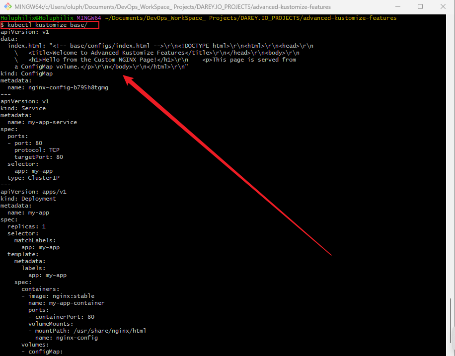

## **Task 7: Update Overlays for Environment-Specific ConfigMaps**

### Objective

Allow environment-specific overrides or additions to the base ConfigMap content using overlays.

### Step 1 – Create custom `index.html` in overlays (optional)

Create `overlays/dev/configs/index.html` with dev-specific content:

```html
<!-- overlays/dev/configs/index.html -->
<!DOCTYPE html>
<html>
<head>
    <title>Dev Environment</title>
</head>
<body>
    <h1>Welcome to the Dev Environment!</h1>
</body>
</html>
```

### Step 2 – Add `configMapGenerator` in overlay kustomization.yaml

For `overlays/dev/kustomization.yaml`:

```yaml
resources:
  - ../../base

patches:
  - path: replica_count.yaml
    target:
      kind: Deployment
      name: my-app

configMapGenerator:
  - name: nginx-config
    behavior: replace
    files:
      - configs/index.html

commonLabels:
  env: dev
```

### Step 3 – Directory structure for overlay with configs

```
overlays/
└── dev/
    ├── configs/
    │   └── index.html
    ├── kustomization.yaml
    └── replica_count.yaml
```

### Step 4 – Test the overlay

Run:

```bash
kubectl kustomize overlays/dev/
```

You should see the ConfigMap with your dev-specific HTML content replacing the base ConfigMap.

**Screenshot:** kubectl kustomize overlays/dev/
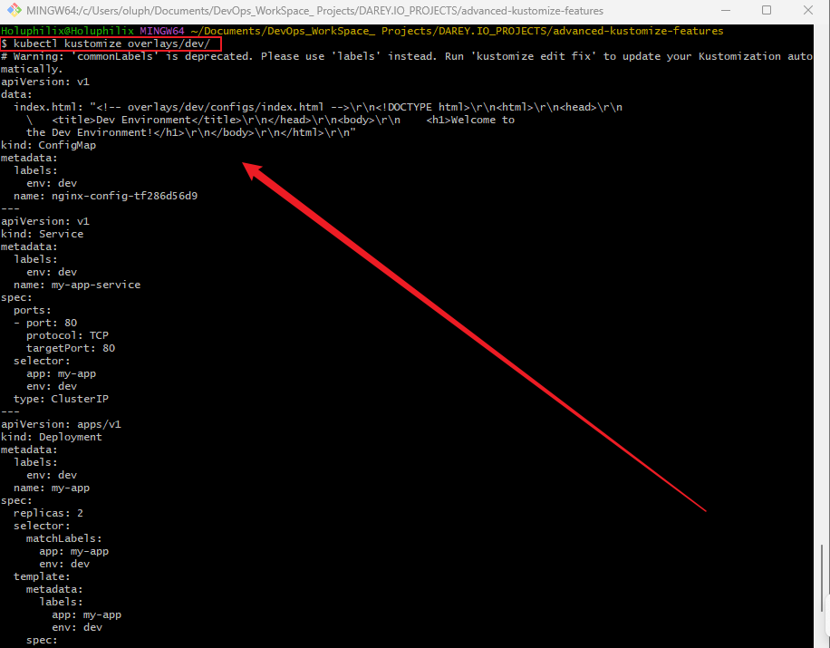


## **Task 8: Deploy, Testing, Verification and Environment-Specific Customizations with Test on Minikube**

### Objective

* Verify that the Kubernetes configurations work correctly across all environments: `dev`, `staging`, and `prod`.
* Demonstrate advanced customization by serving unique NGINX pages per environment using ConfigMaps.
* Ensure each environment uses a distinct NodePort for service exposure to avoid conflicts.
* Validate deployment, service accessibility, and environment isolation.
* Deploy your advanced Kustomize project to a local Minikube Kubernetes cluster and verify the NGINX app serves the correct content per environment.

### Step 1 – Start Minikube

```bash
minikube start
```

**Screenshot:** minikube start
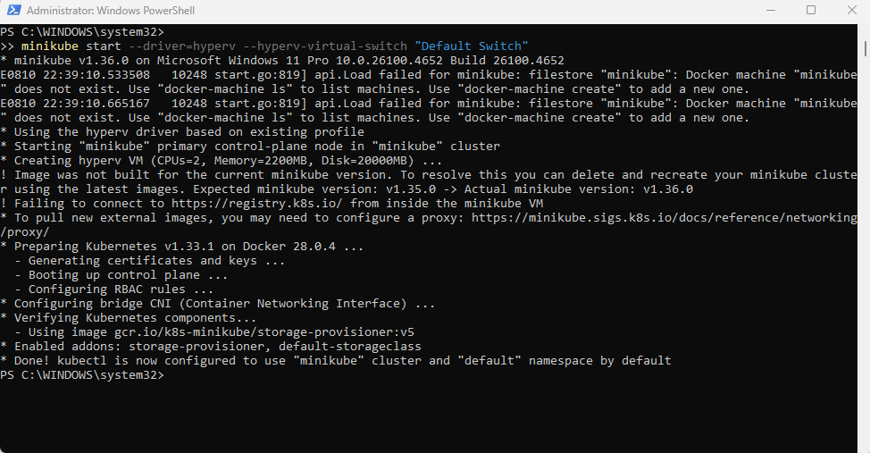

Confirm the cluster is running:

```bash
kubectl get nodes
```
Confirm the minikube status:

```bash
minikube status
```

**Screenshot:** kubectl get nodes
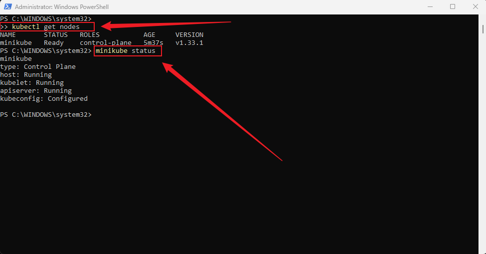

### Step 2 – Build and inspect base manifests 

Navigate to the base directory and generate full manifests:

```bash
cd base
kustomize build .
```
This helps verify your base manifests are correctly composed.

**Screenshot:** Kustomize build .
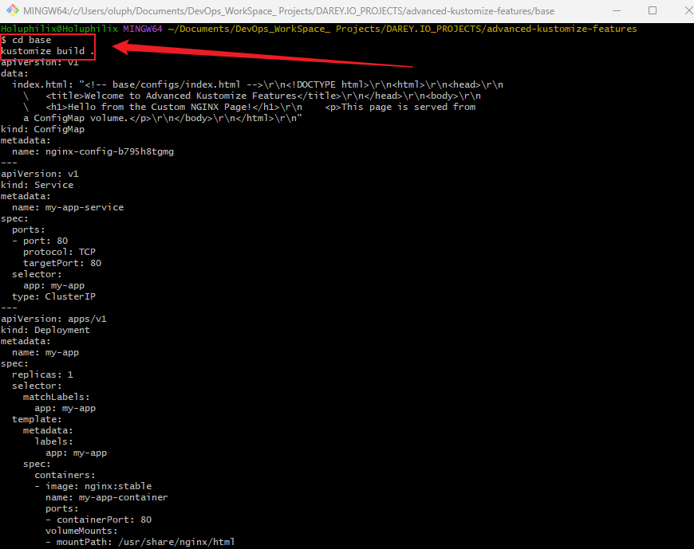

### Step 3 – Deploy the base configuration (optional)

Apply base manifests to the cluster:

```bash
kubectl apply -k ../base/
```

**Screenshot:** kubectl apply -k
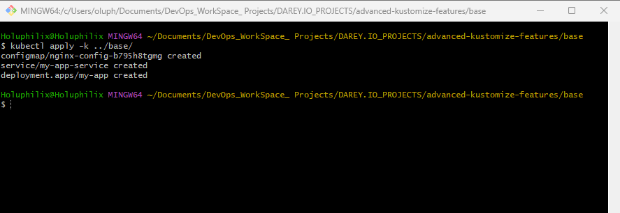

Verify pods and services are running:

```bash
kubectl get pods -l app=my-app
kubectl get svc my-app-service
```

**Screenshot:** kubectl get pod & svc my-app-service
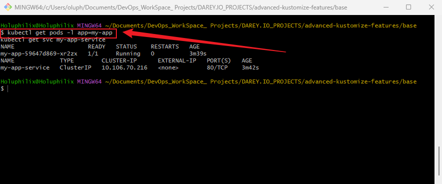

Access the NGINX page:

```bash
minikube service my-app-service
```

**Screenshot:** minikube service
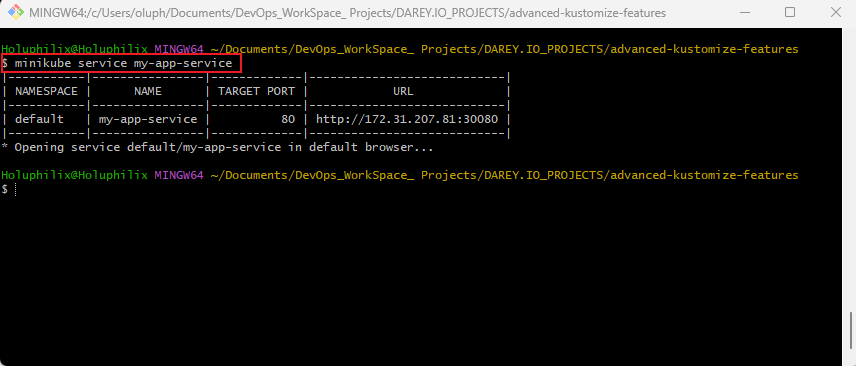

**Screenshot:** NGNIX Page
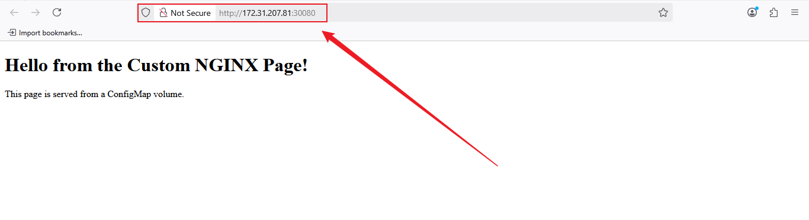

### Step 4 – Deploy the Dev Environment overlay

Navigate back to your project root or overlays directory, then apply the dev overlay:

```bash
kubectl apply -k overlays/dev/
```
**Screenshot:** kubectl apply -k overlays/dev/
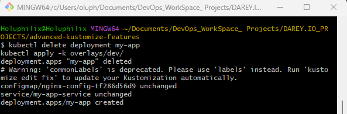

Verify dev pods and services:

```bash
kubectl get pods -l app=my-app,env=dev
kubectl get svc my-app-service
```

**Screenshot:** kubectl get pods & svc my-app-service
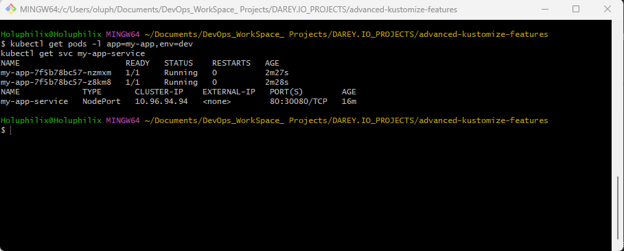

Open the NGINX page served with dev-specific content:

```bash
minikube service my-app-service
```

**Screenshot:** minikube service my-app-service
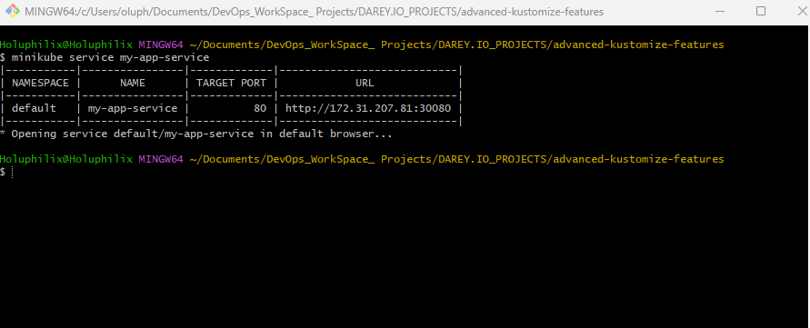

**Screenshot:** **Screenshot:** NGNIX Page


### Step 5: Add Environment-Specific `index.html` Pages for staging and prod.

Create a custom NGINX welcome page for each environment:

* `overlays/staging/configs/index.html`

```html
<!-- overlays/staging/configs/index.html -->
<!DOCTYPE html>
<html>
<head>
  <title>Staging Environment</title>
</head>
<body>
  <h1>Welcome to the Staging Environment!</h1>
</body>
</html>
```

* `overlays/prod/configs/index.html`

```html
<!-- overlays/prod/configs/index.html -->
<!DOCTYPE html>
<html>
<head>
  <title>Production Environment</title>
</head>
<body>
  <h1>Welcome to the Production Environment!</h1>
</body>
</html>
```

### Step 6: Create Environment-Specific Service Definitions with Unique NodePorts

Add `service.yaml` in for staging and prod with environment-specific NodePorts to avoid conflicts:

* `overlays/staging/service.yaml`

```yaml
apiVersion: v1
kind: Service
metadata:
  name: my-app-service
spec:
  type: NodePort
  ports:
    - port: 80
      targetPort: 80
      nodePort: 30081
  selector:
    app: my-app
    env: staging
```

* `overlays/prod/service.yaml`

```yaml
apiVersion: v1
kind: Service
metadata:
  name: my-app-service
  namespace: prod
  labels:
    env: prod
spec:
  selector:
    app: my-app
    env: prod
  ports:
    - protocol: TCP
      port: 80
      targetPort: 80
      nodePort: 30080
  type: NodePort
```

### Step 7: Update Each Overlay’s `kustomization.yaml`

Ensure staging and prod overlays include their service and configMap resources:

```yaml
resources:
  - ../../base

patches:
  - path: replica_count.yaml
    target:
      kind: Deployment
      name: my-app

configMapGenerator:
  - name: nginx-config
    behavior: replace
    files:
      - configs/index.html

commonLabels:
  env: dev
```

### step 8: Deploy and Verify

* Apply each overlay:

```bash
kubectl apply -k overlays/staging/
kubectl apply -k overlays/prod/
```

**Screenshot:** kubectl apply -k overlays staging & prod
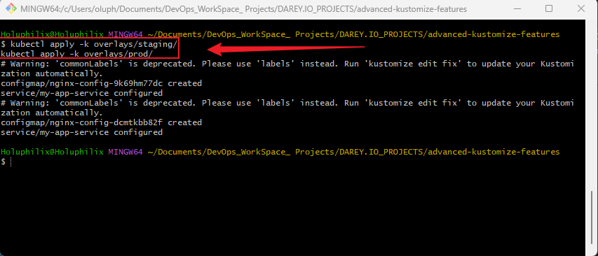

* Verify pods, services, and ConfigMaps are created correctly:

```bash
kubectl get pods
kubectl get svc
kubectl get configmaps
```
**Screenshot:** kubectl get pods, svc and configmaps
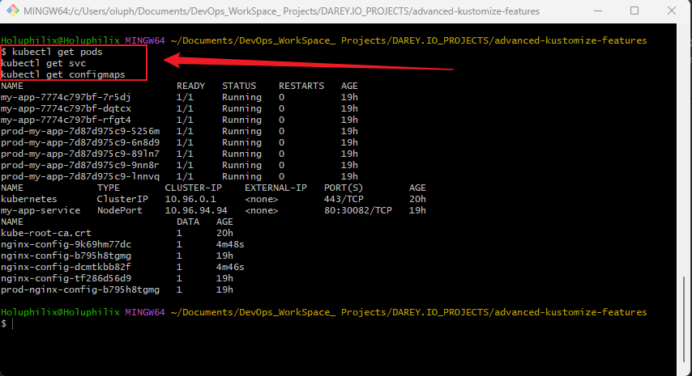

* Access the NGINX page for each environment using Minikube service command:

Step 1: Get the Minikube IP

Run:

```bash
minikube ip
```

- My Minikube IP is **172.31.207.81**.

Now, to access the NGINX pages for your staging and prod environments, open these URLs in your browser:

* **Staging:**

```
http://172.31.207.81:30081
```

**Screenshot:** Ngnix Page for Staging Environment
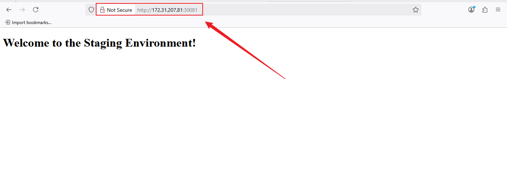

* **Production:**

```
http://172.31.207.81:30080
```

**Screenshot:** Ngnix Page for Production Environment
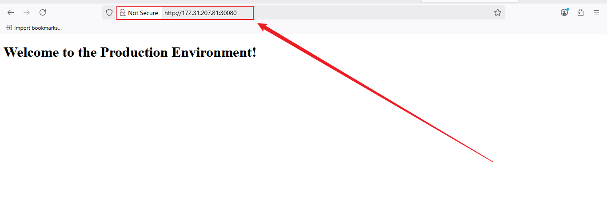

These ports correspond to the NodePorts you assigned for the services.

### Results and Observations

* All environments deployed successfully with their respective replica counts.
* Environment-specific labels and ConfigMaps allowed serving unique NGINX pages.
* Unique NodePorts avoided service port collisions and allowed simultaneous access.
* Project demonstrated effective use of Kustomize overlays, ConfigMaps, and Service customization.


## Task 9: Clean Up & Version Control with Git (Push to GitHub)

### Objective

* Clean your local Kubernetes resources to avoid conflicts.
* Ensure your Git repository is organized, clean, and ready for version control.
* Commit all relevant project files and push to your GitHub repository.

### Step 1: Clean Up Kubernetes Resources (Optional)

Remove all resources deployed for your base and overlays to start fresh or avoid cluster clutter:

```bash
kubectl delete -k overlays/prod/
kubectl delete -k overlays/staging/
kubectl delete -k overlays/dev/
kubectl delete -k base/
```

You can verify deletion with:

```bash
kubectl get all
kubectl get configmaps
kubectl get namespaces
```

### Step 2: Prepare Your Git Repository

Navigate to your project root directory:

```bash
cd ~/Documents/DevOps_WorkSpace_Projects/DAREY.IO_PROJECTS/advanced-kustomize-features
```

### 2.1: Initialize Git repository (if not already initialized)

```bash
git init
```

### Step 3: Stage and Commit Your Files

Add all project files relevant for your Kubernetes Kustomize project:

```bash
git add .
```

Commit with a clear message:

```bash
git commit -m "chore: add advanced Kustomize overlays for dev, staging, prod environments with unique NodePort services"
```

### Step 4: Add Remote Repository and Push to GitHub

### 4.1: Add your GitHub repo as remote: 

```bash
git remote add origin https://github.com/Holuphilix/advanced-kustomize-features.git
```

### 4.2: Push your local commits to GitHub

```bash
git branch -M main
git push -u origin main
```

## Conclusion

This task completed the project by showcasing advanced Kubernetes configuration management using Kustomize overlays. It highlights best practices for:

* Environment isolation and customization.
* Managing configuration data with ConfigMaps.
* Avoiding port conflicts in multi-environment deployments.
* Verifying deployments end-to-end.

This professional setup prepares the project for real-world Kubernetes workflows and promotes maintainability and scalability.

## Author

**Philip Oluwaseyi Oludolamu**

Email: [oluphilix@gmail.com](mailto:oluphilix@gmail.com)

GitHub: [github.com/Holuphilix](https://github.com/Holuphilix)

LinkedIn: [linkedin.com/in/philipoludolamu](https://linkedin.com/in/philipoludolamu)

**Passionate DevOps Engineer focused on Kubernetes, Terraform, and CI/CD automation. Dedicated to building scalable and maintainable infrastructure-as-code solutions.**
